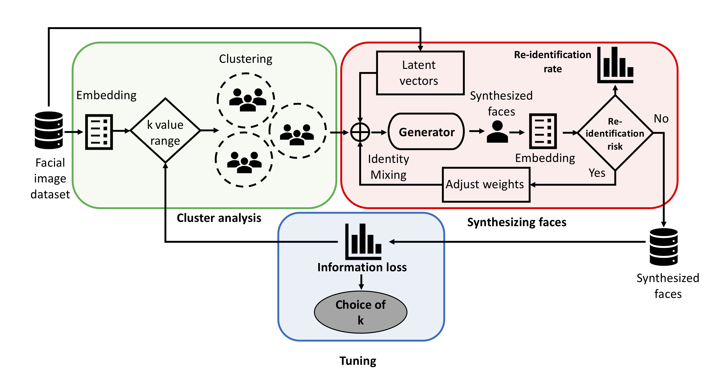
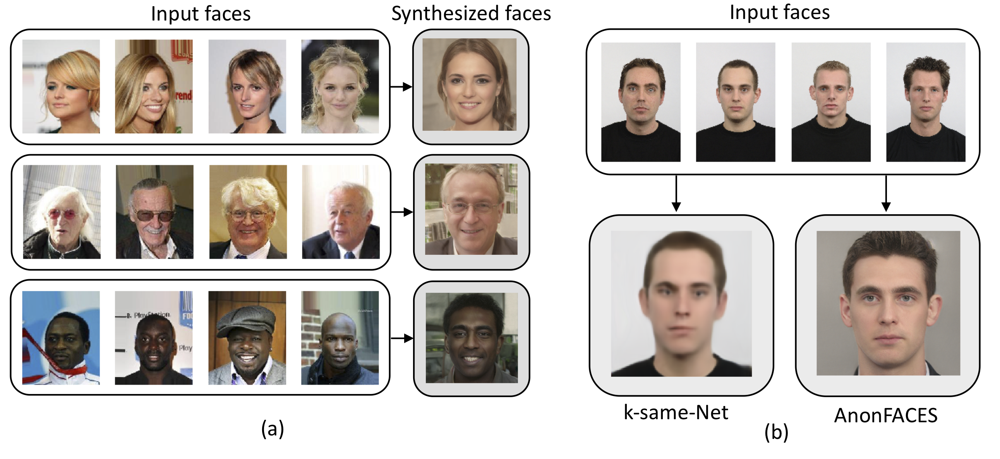

# AnonFACES: Anonymizing Faces Adjusted to Constraints onEfficacy and Security

---

> This is official implementation of paper:

> Minh-Ha Le, Md Sakib Nizam Khan, Georgia Tsaloli, Niklas Carlsson, and Sonja Buchegger, ["AnonFACES: Anonymizing Faces Adjusted to Constraints on Efficacy and Security"](https://www.ida.liu.se/~nikca89/papers/wpes20.pdf), Proceedings of the ACM CCS Workshop on Privacy in the Electronic Society (ACM WPES @CCS), Nov. 2020.


## Abstract

Image data analysis techniques such as facial recognition can threaten individuals' privacy. Whereas privacy risks often can be reduced by adding noise to the data, this approach reduces the utility of the images. For this reason, image de-identification techniques typically replace directly identifying features (e.g.,faces, car number plates) present in the data with synthesized features, while still preserving other non-identifying features. As of today, existing techniques mostly focus on improving the naturalness of the generated synthesized images, without quantifying their impact on privacy. In this paper, we propose the first methodology and system design to quantify, improve, and tune the privacy-utility trade-off, while simultaneously also improving the naturalness of the generated images. The system design is broken down into three components that address separate but complementing challenges. This includes a two-step cluster analysis component to extract low-dimensional feature vectors representing the images (embedding) and to cluster the images into fixed-sized clusters. While the importance of good clustering mostly has been neglected in previous work, we find that our novel approach of using low-dimensional feature vectors can improve the privacy-utility trade-off by better clustering similar images. The use of these embeddings has been found particularly useful when wanting to ensure high naturalness and utility of the synthetically generated images. By combining improved clustering and incorporating StyleGAN, a state-of-the-art Generative Neural Network, into our solution, we produce more realistic synthesized faces than prior works, while also better preserving properties such as age, gender, skin tone, or even emotional expressions.   Finally, our iterative tuning method exploits non-linear relations between privacy and utility to identify good privacy-utility trade-offs. Wenote that an example benefit of these improvements is that our so-lution allows car manufacturers to train their autonomous vehicles while complying with privacy laws.

<p align='center'>
  
</p>  

---

# Preliminary
Before you start the notebooks:
- Make sure required packages in ```requirements.txt``` are installed (please note that we ran our experiments on Microsoft's Azure Data Science Virtual Machine with some pre-installed packages, if you run our code on your local machine, the requirements may be differ)
- Download a pre-trained StyleGAN model ```karras2019stylegan-ffhq-1024x1024.pkl``` (can be found at [StyleGAN's Github repo](https://github.com/NVlabs/stylegan) ) and put it to folder ```stylegan/cache/```
- Download our [pre-trained CNN model](https://drive.google.com/file/d/1EhaiYQ0uWPPkmglnwjUNX_m6WU92z_bL/view?usp=sharing) ```FaceGen.RaFD.model.d5.adam.h5``` and put it to folder ```CNN/output/```
- Prepare your facial descriptors (embbedings) which can be calculated by [Dlib](http://dlib.net), [FaceNet](https://github.com/davidsandberg/facenet) or PCA. Default folder is ```datasets/encoding_data/```  
- Prepare your StyleGAN's latent vectors which can be calculated by [StyleGAN-encoder](https://github.com/Puzer/stylegan-encoder). Default folder is ```datasets/stylegan_data/latent_vectors```. 

---
# Paths


|Path | Description
| :--- | :---
├── CNN | Submodule of Up-Convolutional Network
├── README.md
├── [NB]\ NumericalExperiments.ipynb | Evaluations for face descriptors/anonymisers
├── [NB]\ Partitioning.ipynb | Evaluation of fixed-size clustering (partitioning) algorithm
├── [NB]\ VisualizingResults.ipynb | Visualising data
├── anonymizer | Image anonymiser/syntheriser
│   ├── __init__.py
│   ├── aam.py | Active Appearance Model 
│   ├── cnn.py | Up-convolutional Network
│   └── styleGan.py | StyleGAN
├── datasets | Prepared data for evaluations
│   ├── encoding_data | Face desciptors / embbeddings
│   └── stylegan_data | Encoded latent vectors
├── evaluation.py | Support functions for evaluations
├── outputs | Folder for outputs
├── partitioning.py | Fixed-size clustering algorithms
├── requirements.txt
├── stylegan | Submodule of StyleGAN
├── utils.py | Utilities functions
└── vizualization.py | Support functions for visualising results


---
# Evaluations

The evaluations for the paper is provided in the notebooks:
- Evaluation with different face embeddings, anonymizers ```NumericalExperiments.ipynb```
- Evaluation with different fixed-size clustering algorithms ```Partitioning.ipynb```
- Visualizing the evaluation results ```VisualizingResults.ipynb```

<p align='center'>
  
</p>

---
# Citation

If you use our code, please cite our paper:

Minh-Ha Le, Md Sakib Nizam Khan, Georgia Tsaloli, Niklas Carlsson, and Sonja Buchegger, “AnonFACES: Anonymizing Faces Adjusted to Constraints on Efficacy and Security”, Proceedings of the ACM CCS Workshop on Privacy in the Electronic Society (ACM WPES @CCS), Nov. 2020.
